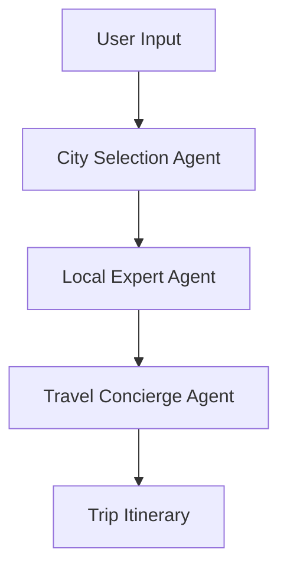

# 🏖️ VacAIgent: AI-Powered Travel Planner


An intelligent travel planning application built with CrewAI that uses multiple AI agents to create personalized trip itineraries. Available as a web app (Streamlit), command-line interface (CLI), and REST API (FastAPI).

## 🌟 Features

- **Multi-Agent AI System**: Leverages CrewAI framework with specialized agents for city selection, local expertise, and travel concierge services
- **Multiple Interfaces**: Choose between web UI, CLI, or API integration
- **Comprehensive Trip Planning**: Includes weather analysis, cost estimation, attraction recommendations, and detailed itineraries
- **Real-Time Data**: Integrates with search engines and web scraping for up-to-date information
- **Flexible LLM Support**: Supports Gemini, Groq, OpenAI, and local Ollama models
- **Budget Analysis**: Provides detailed cost breakdowns and packing suggestions

## 🚀 Quick Start

### Prerequisites

- Python 3.8+
- API keys for:
  - [Google Gemini](https://ai.google.dev/) (default LLM)
  - [Serper.dev](https://serper.dev/) (web search)
  - [Browserless.io](https://www.browserless.io/) (web scraping)

### Installation

1. Clone the repository:
```bash
git clone https://github.com/Monish-Nallagondalla/crewai_travel_planner.git
cd crewai_travel_planner
```

2. Install dependencies:
```bash
pip install -r requirements.txt
```

3. Set up environment variables:
Create a `.env` file in the root directory:
```env
GEMINI_API_KEY=your_gemini_api_key
SERPER_API_KEY=your_serper_api_key
BROWSERLESS_API_KEY=your_browserless_api_key
```

## 📖 Usage

### Streamlit Web App

Run the interactive web interface:

```bash
streamlit run streamlit_app.py
```

Navigate to `http://localhost:8501` and enter your trip details in the sidebar.

### Command Line Interface

Plan a trip via CLI:

```bash
python cli_app.py \
  --origin "Bangalore, India" \
  --destination "Krabi, Thailand" \
  --start-date 2024-05-01 \
  --end-date 2024-05-10 \
  --interests "2 adults who love swimming, dancing, hiking, shopping, local food, water sports"
```

### REST API

Start the FastAPI server:

```bash
uvicorn api_app:app --reload
```

The API will be available at `http://localhost:8000`.

#### API Endpoints

- `GET /` - Welcome message and documentation links
- `POST /api/v1/plan-trip` - Generate trip plan
- `GET /api/v1/health` - Health check

#### Example API Request

```bash
curl -X POST "http://localhost:8000/api/v1/plan-trip" \
  -H "Content-Type: application/json" \
  -d '{
    "origin": "Bangalore, India",
    "destination": "Krabi, Thailand",
    "start_date": "2024-05-01",
    "end_date": "2024-05-10",
    "interests": "2 adults who love swimming, dancing, hiking"
  }'
```

## 🏗️ Project Structure

```
crewai_travel_planner/
├── api_app.py              # FastAPI application
├── cli_app.py              # Command-line interface
├── streamlit_app.py        # Streamlit web application
├── trip_agents.py          # AI agent definitions
├── trip_tasks.py           # Task definitions for agents
├── tools/                  # Custom tools for agents
│   ├── browser_tools.py    # Web scraping tool
│   ├── calculator_tools.py # Calculation utilities
│   └── search_tools.py     # Web search tool
├── images/                 # Static assets
├── requirements.txt        # Python dependencies
├── flow_diagram.svg        # Architecture diagram
├── .gitignore
├── LICENSE
└── README.md
```

## 🤖 AI Agents

### City Selection Expert
- Analyzes weather patterns, seasonal events, and travel costs
- Compares multiple destination options
- Provides detailed reports on chosen cities

### Local Expert
- Gathers in-depth information about attractions and customs
- Discovers hidden gems and local recommendations
- Creates comprehensive city guides

### Travel Concierge
- Develops detailed itineraries with daily plans
- Provides budget breakdowns and packing suggestions
- Recommends specific hotels, restaurants, and activities

## ⚙️ Configuration

### Environment Variables

| Variable | Description | Required |
|----------|-------------|----------|
| `GEMINI_API_KEY` | Google Gemini API key | Yes |
| `SERPER_API_KEY` | Serper.dev search API key | Yes |
| `BROWSERLESS_API_KEY` | Browserless.io scraping API key | Yes |

### Switching LLM Models

Edit the `llm` parameter in `TripAgents` class:

```python
# For Groq
self.llm = LLM(model="groq/deepseek-r1-distill-llama-70b")

# For OpenAI
self.llm = ChatOpenAI(model_name="gpt-4")

# For Ollama (local)
self.llm = LLM(model="ollama/llama3.2", base_url="http://localhost:11434")
```

## 📋 Dependencies

Key dependencies include:

- `crewai` - Multi-agent framework
- `streamlit` - Web UI framework
- `fastapi` - REST API framework
- `uvicorn` - ASGI server
- `langchain` - LLM integration
- `requests` - HTTP client
- `unstructured` - Document processing
- `pydantic` - Data validation

See `requirements.txt` for complete list.

## 🔄 Workflow



## 📝 API Documentation

Interactive API documentation available at:
- Swagger UI: `http://localhost:8000/docs`
- ReDoc: `http://localhost:8000/redoc`

## 🤝 Contributing

1. Fork the repository
2. Create a feature branch: `git checkout -b feature/amazing-feature`
3. Commit changes: `git commit -m 'Add amazing feature'`
4. Push to branch: `git push origin feature/amazing-feature`
5. Open a Pull Request

## 📄 License

This project is licensed under the MIT License - see the [LICENSE](LICENSE) file for details.

## ⚠️ Disclaimer

- This application uses external APIs which may incur costs
- Ensure you have proper API access and monitor usage
- Trip recommendations are AI-generated and should be verified
- Always check current travel advisories and requirements

## 🙏 Acknowledgments

- [CrewAI](https://www.crewai.com/) for the multi-agent framework
- [Streamlit](https://streamlit.io/) for the web interface
- [FastAPI](https://fastapi.tiangolo.com/) for the API framework
